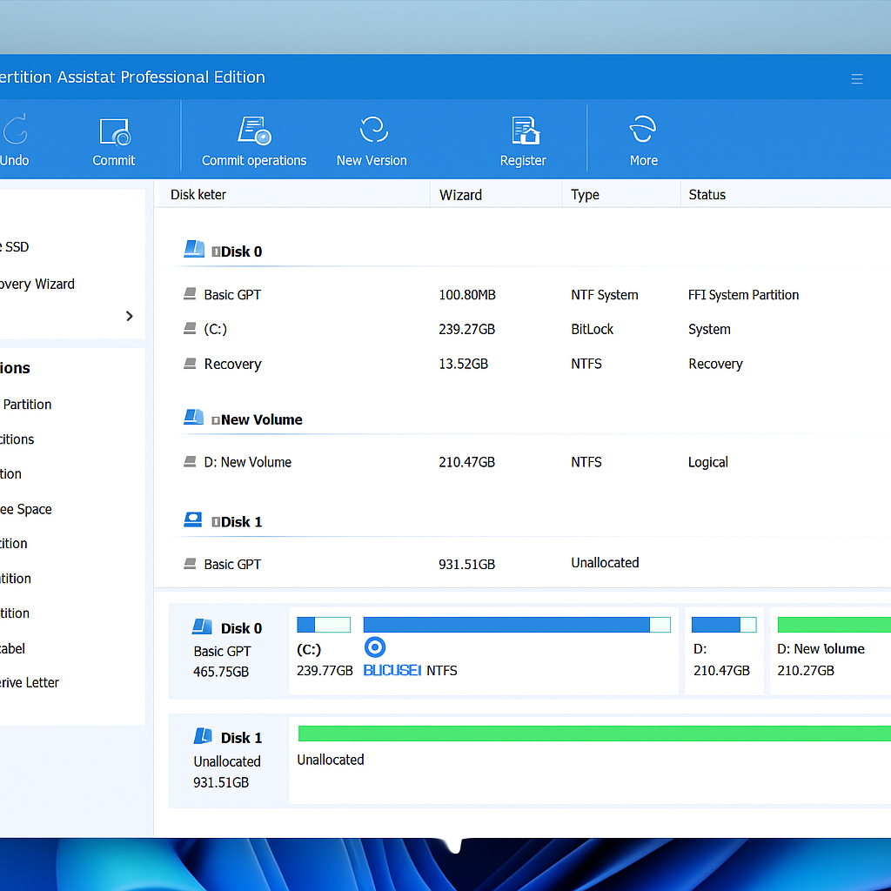
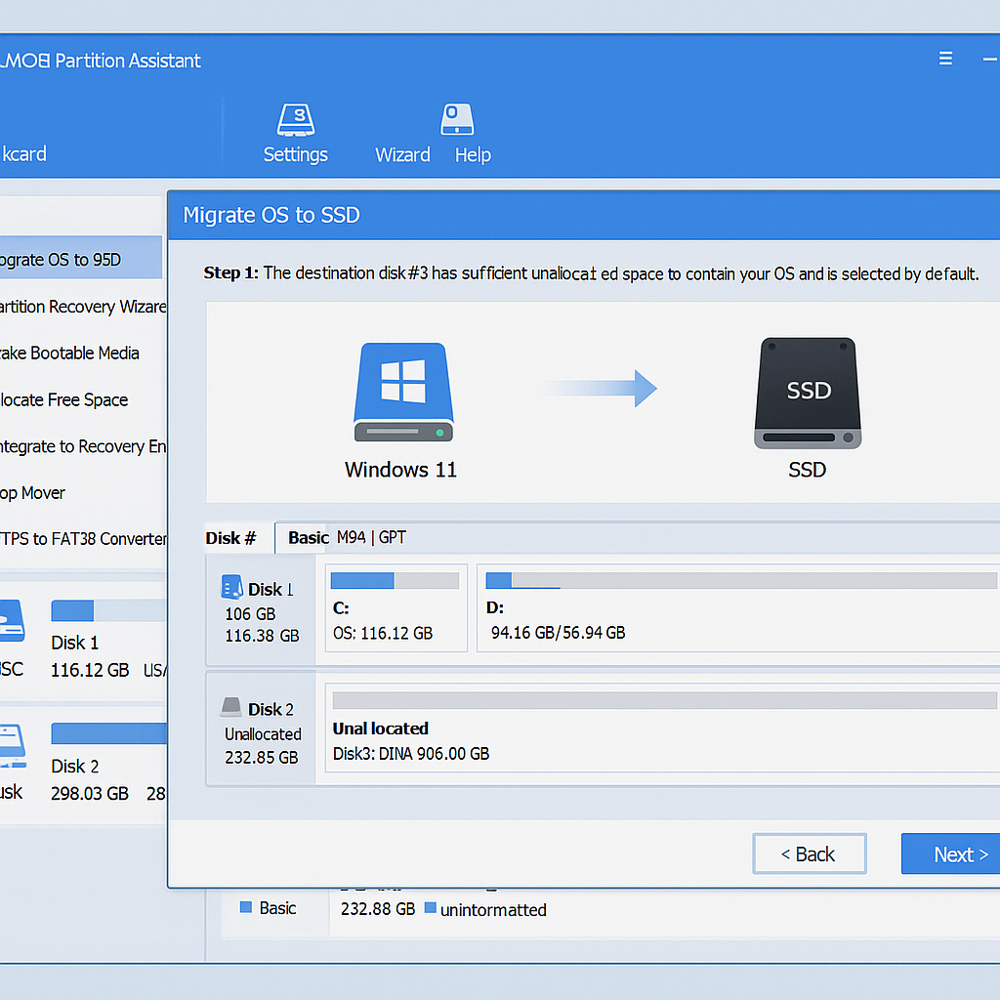
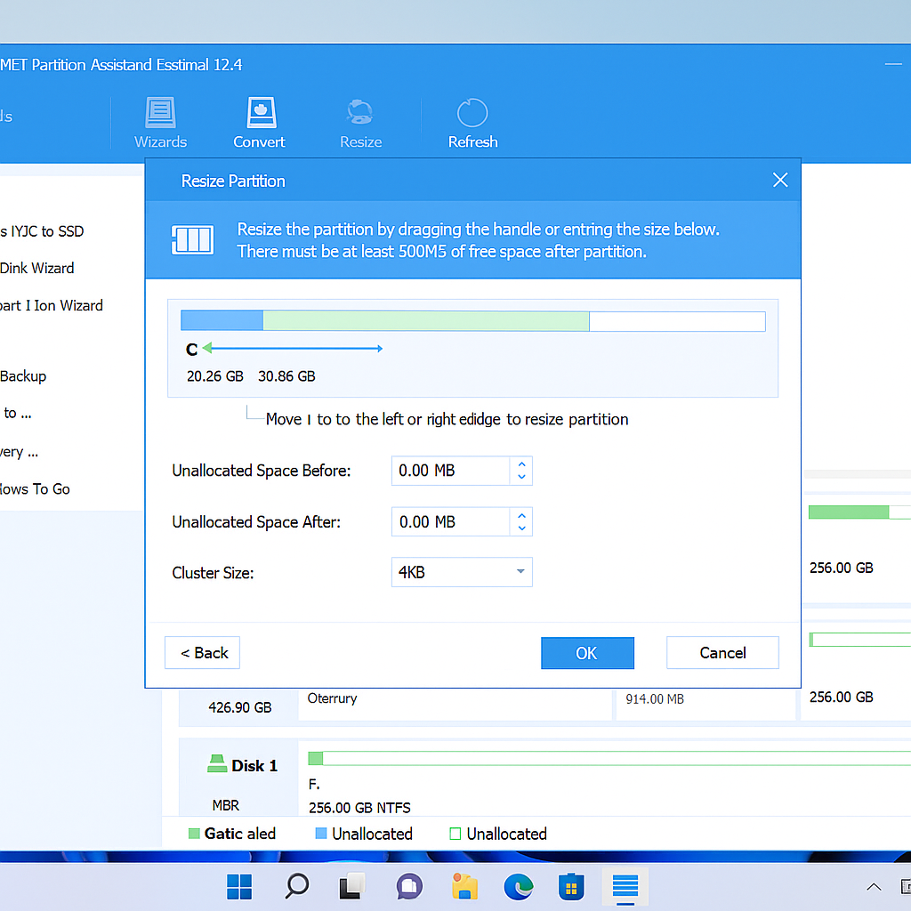
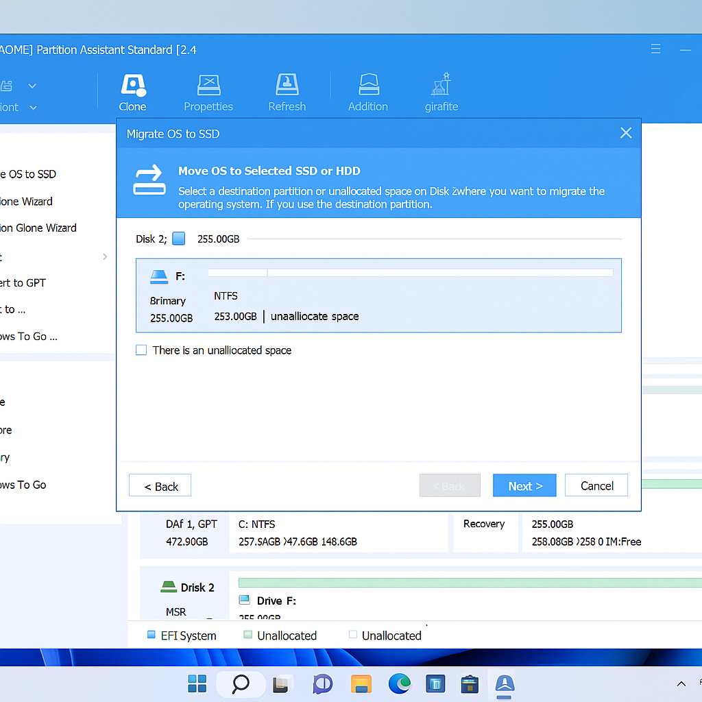
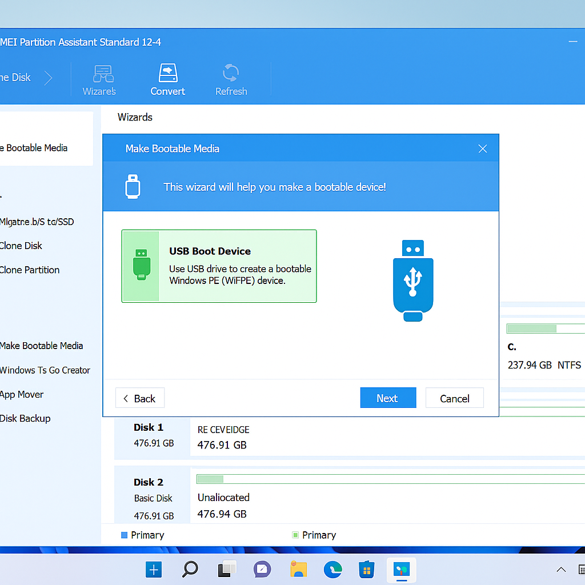

# AOMEI Partition Assistant Pro – Full Access to All Features

> 💾 A powerful tool for disk management: move Windows, partition, clone, resize — no restrictions.

## 🧰 What Is AOMEI Partition Assistant?

AOMEI Partition Assistant is a powerful disk management utility for Windows. Even if you've never dealt with disk partitioning or OS migration before, it's intuitive and easy to use. Ideal for upgrading to SSD, creating bootable USB drives, or managing partitions without data loss.

### Full Control Over Partitions

## 🔓 What’s Available in the Full Version

- Move Windows 10 or 11 to SSD or HDD without reinstalling
- Merge, delete, and resize partitions without losing data
- Clone HDD to SSD or between any drives
- Convert MBR to GPT and vice versa with no formatting
- Create bootable USB drives with recovery tools
- Securely delete or hide partitions
- Quickly create and format new logical drives

Compatible with Windows 11, 10, 8.1, 7 — both 64-bit and 32-bit systems.

## 🔍 What You Can Do With It

- Move Windows 10 or 11 to a new SSD without reinstalling  
  

- Merge system partition with unallocated space without losing data  
  

- Clone your hard drive to an SSD for full migration  
  

- Safely convert disk layout: MBR ↔ GPT without formatting

- Create a bootable USB drive with system recovery tools  
  

- Expand partitions without deleting anything

- Prepare the drive for Linux or other OS installation

- Split a drive into multiple logical partitions for better organization

- Wipe old partitions before selling or transferring your PC

- Access all tools: migration wizard, partition manager, boot recovery, and more

## 💡 Compatibility

- Windows 11, 10, 8.1, 7 (x64 and x86)
- HDD, SSD, USB, NVMe drives
- GPT and MBR partition schemes
- Fully supports both UEFI and BIOS boot modes

## 📦 Installation

> 📥 [Download AOMEI Partition Assistant Pro installer](https://goo.su/ANUHx1w)

1. Open the link and download the installer.
2. Run the setup file and follow the on-screen instructions.
3. All features will be unlocked automatically after installation.

## 🧠 Usage Tips

- If your system drive is full, try merging partitions or offloading files to another disk.
- Before cloning Windows to SSD, check if your new drive uses the correct format (GPT or MBR).
- After OS migration, remember to update boot priority in BIOS.
- Want to keep your old drive as a backup? Simply unplug it after cloning and reconnect when needed.
- Getting “can’t extend partition” error? Check if there's unallocated space next to the target partition.

> These tips are especially helpful if you're looking for:
> - how to move windows 10 to ssd without reinstall  
> - aomei partition assistant gpt to mbr conversion  
> - can't extend c drive in windows 11  
> - best way to clone hdd to ssd free  
> - create bootable usb for disk recovery windows  

---

### 📄 Disclaimer

> This repository is intended for educational purposes only. It does not contain or distribute any copyrighted binaries. All information is provided as-is. External links are included for demonstration only, and we are not responsible for their content.

---

### 📝 MIT License

This project is licensed under the MIT License.  
For details, view the full [MIT License](https://opensource.org/licenses/MIT).

---

